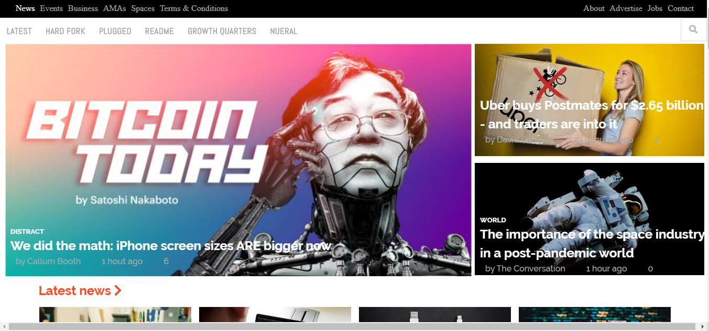

# Building-with-responsive-design
A project to test our abilities in responsive designing - A Microverse Collaborative Project (Stanley and José Francisco)

## Built With

- HTML
- CSS

## Live Demo

[Live Demo Link](https://raw.githack.com/SunnySparks/Building-with-responsive-design/feature-branch/index.html)

## Getting Started

**Navigation bar**
- Go to [The Next Web](https://www.thenextweb.com/) and have a look around, the purpose of this project was to replicate the responsive effect of the website with respect to screen size variation.

To get a local copy  and to set it up and running follow these simple example steps.

### Prerequisites

- Browser
- Internet

- Download the code from repository (https://github.com/SunnySparks/Building-with-responsive-design) and double click the index.html file

## Authors

👤 **Stanley Enow Lekunze**

- Github: [@happiguru](https://github.com/happiguru)
- Twitter: [@Lekunze_Nley](https://twitter.com/Lekunze_Nley)
- Linkedin: [lekunze-nley](https://www.linkedin.com/in/lekunze-nley/)

👤 **José Francisco Silva Díaz**

- Github: [@SunnySparks](https://github.com/sunnySparks)
- Twitter: [@JosFranT6](https://twitter.com/josfrant6)
- Linkedin: [linkedin](https://www.linkedin.com/in/josé-francisco-silva-díaz-a2a9421a6)

## Show your support

Give a ⭐️ if you like this project!

## Acknowledgments
-This project gave us a better understanding of the visual properties that must be used on a website.

## 📝 License

This project is [MIT](LICENSE) licensed.
